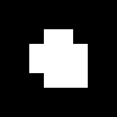

## ENPM 673: Project1 - AR Tag Detection and Virtual Reality

This project focuses on detecting a custom AR Tag(a form of fiducial marker), that is used for
obtaining a point of reference in the real world, such as in augmented reality applications. The two aspects
to using an AR Tag: detection and tracking, has been implemented in this project. Following are the 2
stages:

* **Detection**: Involves finding the AR Tag from a given image sequence
* **Tracking**: Involves keeping the tag in “view” throughout the sequence and performing image
processing operations based on the tag’s orientation and position (a.k.a. the pose).

Before implementing image processing on the image sequence, the video is split into its image frames using `cv2.VideoCapture`, and once the operations are performed on each of the frames, it is appended into an array. This image array is then used to get the video using `cv2.VideoWriter`.

Following is the reference AR Tag that has to be detected and tracked:

## Edge Detection of AR tag

AR Tags facilitate the appearance of virtual objects, games, and animations within the real world.  The
analysis of these tags can be done as followed.
* The tag has been decomposed into an 8*8 grid of squares, which includes a padding of 2 squares width
along the borders.  This allows easy detection of the tag when placed on white background.
* The inner 4*4 grid (i.e.  after removing the padding) has the orientation depicted by a white square in
the lower-right corner.  This represents the upright position of the tag.  This is different for each of the
tags provided in the different image sequences.
* Lastly, the inner-most 2*2 grid (i.e.  after removing the padding and the orientation grids) encodes the
binary representation of the tag’s ID, which is ordered in the clockwise direction from least significant
bit to most significant.  So, the top-left square is the least significant bit, and the bottom-left square is
the most significant bit.

Following image shows the grid overlayed on the reference marker tag.

The process of the edge and corner detection has been implemented in the following way:

* The video is first converted into image frames.
* Detection is performed on each of the frames.
* The image is converted into grayscale, then smoothed with median blurring and converted to thresholded binary image. Then `cv2.findContours` is used to detect the contours and finally the detected corners are stored in an array.
* Some of the computer vision used with inbuild OpenCV functions are:
  - `cv2.cvtColor`
  - `cv2.medianBlur`
  - `cv2.threshold`
  - `cv2.findContours`
  - `cv2arcLength`
  - `cv2.approxPolyDP`
  - `cv2.contourArea`
  - `cv2.isContourConvex`
* Once the Corners are successfully detected, the perspective transformation of the Tag is performed.
The function `perspective for tag` has been scripted to get the transformed and resized tag image.
The methods used for the transformation are:
  - `cv2.findHomography`
  - `cv2.warpPerspective`
  - `cv2.resize`
* After the above successful transformation the ID of the tag is obtained, the corners of the tag as well
as its ID with respect to its original orientation i.e compensated for any camera rotation is obtained.

## Superimposing of image on AR tag

Homographic transformation is the transformation between two planes in projective space. In augmented reality, it is the transformation that projects a square marker board from the world coordinate system into a polygon in the image plane on the camera sensor (i.e., pixel coordinates).  In this project, once the 4 corners of the tag are detected with the edge and corner detection done above, homography estimation is performed, such as superimposing the image (Example: lena.jpeg) over the tag. 

The following steps has been successfully implemented in this part of the project:
* Homography between the corners of the template and the four corners of the tag has been computed
using the corners of the AR tag detected in the first part of the project.  The homography matrix has
been manually calculated in the code by finding Singular Value Decomposition of the world and camera coordinates system.
The SVD function of the Linear Algebra library from the Numpy library has been used to calculate
the same.
* Once the transformation of the template image has been sucessfully done above, tag has been done,
the tag is “replaced” with the transformed image.
* This also implies that the orientation of the transformed template image must match that of the tag at
any given frame, considering efficient corner, contour and edge detection techniques to get the correct orientation of the AR tag at any given time.
* The above has been achieved using the calculated homography matrix to get the `cv2.warpPerspective` along with the CV function
 `cv2.fillConvexPoly`.

### Output Images of Lena Superimposed on AR Tag:

Following are the screenshots of the superimposed images of lena.jpeg on the AR Tag. It can be seen that the superimposed  image  maintains  its  orientation,  thus compensating for the rotation of the camera.

## Placing virtual 3D Cube on AR tag

Here the process of “projecting” a 3D shape onto a 2D image has been implemented.

* The homography between the world coordinates (the reference AR tag) and the image plane (the tag
in the image sequence) is first computed.  The calculation of this has been done by detecting the four
corners of the marker in the input image captured by camera i.e the true corners for the UPRIGHT
orientation of marker).
* The  world  coordinates  of  the  corners  is  determined  and  the  homography  is  computed  between  the
detected corner points in the image (pixel coordinates) and the corresponding points in the reference
(world) coordinate system.
* The projection matrix is then built from the given camera calibration matrix provided and the homog-
raphy matrix.  Here the camera’s pose i.e the rotation matrix R and translation vector t is found as
shown in the code, and thus the projection matrix, P = K[R|t] is constructed.
* Assuming that the virtual cube is sitting on “top” of the marker, and that the Z axis is negative in the
upwards direction, we have obtained the coordinates of the other four corners of the cube.  This allows
the transformation of all the corners of the cube onto the image plane using the projection matrix.
* The cube is then drawn using `cv2.drawContours`.

### Output Images of 3D Cube Superimposed on AR Tag:

